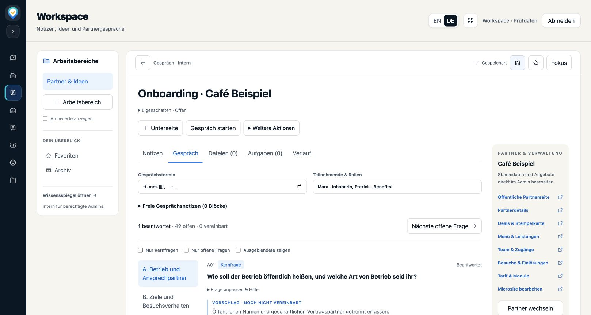

# Interner Workspace und Partner-Onboarding

Der Master-Admin erhält `/workspace` mit Arbeitsbereichen, Seiten/Unterseiten, Notizen und Ideen. Aus der Partnerbearbeitung führt „Workspace öffnen“ in den passenden Partnerkontext. Eine Partnerakte kann ein neues Gespräch mit 50 anpassbaren Fragen (26 Kernfragen) beginnen.

Enthalten: Text-/Listen-/Checklistenblöcke, Suche in Text und Antworten, Typ-/Status-/Tag-/Partnerfilter, Tabellen- und Boardansicht, persönliche Favoriten, Archiv/Wiederherstellung, leere wiederverwendbare Gesprächsvorlagen, Dateilinks, Aufgaben mit Nachweisen, Markdown/JSON-Export sowie Versionen und Wiederherstellung. Jedes Gespräch trennt Vorschlag, Partnerantwort, Änderungswunsch und Vereinbarung. Die bestehenden Partnereditoren bleiben die Quelle veröffentlichter Angebote und Stammdaten.

## Benutzung

1. Workspace öffnen, Arbeitsbereich anlegen und eine Notiz oder Partnerakte erstellen.
2. In der Partnerakte den Partner zuordnen und „Gespräch starten“ wählen. Fokusmodus bietet Platz während des Gesprächs.
3. Antworten und Abweichungen erfassen. Deals, Stempelkarte, Microsite und Tarifprüfung öffnen sich über die Partnerlinks in einem neuen Tab.
4. Vereinbarte Umsetzung als Aufgabe mit Zuständigkeit und Termin festhalten. Erst nach Bearbeitung und Prüfung als erledigt markieren.
5. Auf „Gespeichert“ achten. Bei Versionskonflikt vergleichen, den Entwurf als Kopie sichern oder die Serverfassung laden. Export bleibt verfügbar.

## Bereitstellung

Zuerst die zusammengehörige Migration `20261005153637_admin_partner_workspace.sql` aus Benefitsi-Database nach Review in der gewünschten Umgebung anwenden, danach diesen Admin-Stand bereitstellen. In dieser Aufgabe wurden keine gemeinsame Datenbank und keine Produktionsumgebung verändert. Ohne Migration zeigt der Admin einen Einrichtungsfehler und überschreibt nichts.

Die SQL-Migration schützt alle vier Tabellen durch Admin-RLS und widerrufene direkte Schreibrechte. Jeder Server Action authentifiziert erneut. Schreib-RPCs prüfen den Admin selbst, vergleichen Revisionen und schreiben Inhalt und Historie atomar. Partner und öffentliche Clients erhalten keinen Zugriff. Kein Hard-Delete-Endpunkt; Archiv und Historie erhalten Daten. Links übernehmen die Berechtigungen ihrer Quelle.

## Prüfung am 05.10.2026

- 73 gezielte Tests bestanden: echte React-Komponenten mit Transportadapter, Model/Template/Export, Speicherwarteschlange, Pagination, Navigation und Zugangstrennung. Neue Tests decken langsame Antworten, Konflikte, Browser-Historie, Formziel, verlorene Create-Antworten und Kopier-Wiederholungen ab.
- Datenbank: 18 echte PostgreSQL-Verhaltenstests bestanden. Zusätzlich kompletter Anwendungs-Fragebogen → echte RPC → Anwendungsvalidator erfolgreich; Antwortupdate erzeugt Revision 2. Temporäre Datenbanken anschließend entfernt.
- Alle 50 Fragetexte, Vorschläge und Kernflags exakt mit dem abgestimmten Leitfaden verglichen.
- ESLint für neue Workspace-Dateien und Tests bestanden. TypeScript besteht für den gesamten Quellbaum mit Ausnahme des unveränderten Bild-Workers: in den wiederverwendeten lokalen Abhängigkeiten fehlt `onnxruntime-web/webgpu`. Der uneingeschränkte Typecheck meldet allein diese fehlende Alt-Abhängigkeit.
- Gesamtsuite: 1.360 Tests, davon 1.337 bestanden und 23 bestehende Fehler. Alle 23 auf unverändertem Basiscommit `057c336` mit denselben Abhängigkeiten reproduziert: `deal-save-action`, `milestone-save`, `dependency-braces-security`, `partner-chart-data`, `partner-dashboard-ui`. Anschließender gezielter Lauf einschließlich zusätzlichem Kopier-Retry-Test: 73/73.
- Browser: echte UI/CSS mit synthetischen Daten und Transportadapter; Desktop und Fokusmodus bei 390 px ohne horizontalen Seitenüberlauf, Speicherung/Antwortfortschritt kontrolliert; keine Browserfehler. Die lokale Vorschau ist kein Nachweis einer produktiven Bereitstellung.

Bei ausstehenden Änderungen hält der Historienwächter den Entwurf bis zur Speicherung zurück; dabei kann sich der Browser-Verlauf durch das Zurücksetzen der Adresse verändern. Es gibt keine Offline-Synchronisierung oder gleichzeitige Textbearbeitung wie in Notion; parallele Änderungen werden als Konflikt behandelt.

Lokale Prüfkommandos (vorhandene Abhängigkeiten verwenden):

```sh
node --import tsx --test tests/workspace-*.test.mjs tests/admin-navigation*.test.mjs tests/portal-routing.test.mjs tests/portal-security.test.mjs
node node_modules/eslint/bin/eslint.js app/workspace components/workspace lib/workspace tests/workspace-*.mjs tests/helpers/workspace-fixture.mjs
node --import tsx tests/workspace-browser-check.mjs
```

Der Browser-Prüfserver lädt weder Zugangsdaten noch Produktionsdaten und endet bei Ctrl+C. [Gesprächsleitfaden](onboarding-fragen.md) · [Abgestimmter Entwurf](design.md)


